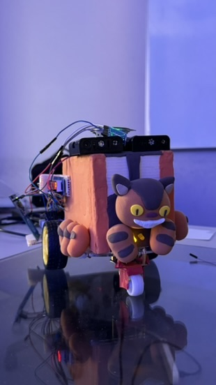
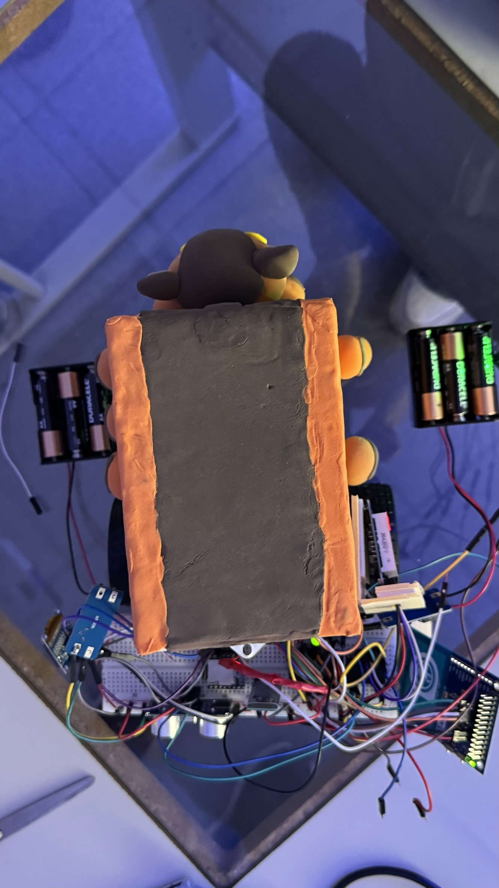

# Welcome-on-board

We are implementing an autonomous smart car system using the **PIC XC8** compiler.

The system is integrated with an **HC-05 Bluetooth module**, serving as a bi-directional bridge between our custom Android application and the target **PIC18F4520** microcontroller (via UART).

### Project Inspiration: _My Neighbor Totoro_

> _My Neighbor Totoro_ is a beloved Japanese animation deeply rooted in our hearts.
>
> Inspired by Totoro's warm-hearted nature, we designed this system to bring joy to its interactions. When passengers tap their card on the **RFID sensor**, the car plays the "On-Board Dance" theme song while the integrated light stick glows in synchronization. This feature aims to create a shared moment of cheer, reflecting our belief that technology should positively impact human connection and foster a brighter future.

## Automated Car Components

We utilize the following hardware components to ensure precise control and interactivity.

### Microcontroller & Processing

1. **MCU:** Microchip PIC18F4520
2. **Programmer:** MPLAB PICkit 4
3. **Audio:** DFPlayer Mini (MP3 Player Module)

### Sensors

### Sensors & Input

1. **Identification:** RFID Sensor Module (PN532)
2. **Environment:** Ambient Light Sensor (ALS) Module
3. **Navigation:** Ultrasonic

### Displays

1. 7-segment Display
2. OLED Display

### Actuators & Power

1. **Drive:** L298N Motor Driver
2. **Motors:** DC Motors
3. **Power:** 12x AA Batteries

### Outputs

1. 4 $\ohm$ 3W speaker

## Mobile App Workflow

1. **Voice Activation** - Tapping the mic button activates the device's native speech recognition engine.
2. **Real-Time Transcription** - The app captures audio input and converts speech to text instantaneously.
3. **Intent Resolution** - The transcribed text is processed to identify the user's intent.
4. **LLM Parsing** - The text is sent to gemini-2.0-flash to convert natural language (e.g., "Please turn left now") into a standardized protocol command (e.g., `TURN_LEFT`).
5. **Bluetooth Transmission** - The resolved command is transmitted via Bluetooth to the HC-05/ESP32 receiver.

## Hardware Functionalities

1. When the car gets too close to obstacles such as walls, it stops the motor instantly.
2. When surrounding is too dark, ALS senses it and is going to turn the front light on.
3. When tapping correct RFID card to PN532, it activates DFPlayer and plays music to inform of arrivial, which resembles real buses.
4. OLED display shows the mood of Totoro Bus.
5. 7 segment display shows the current gears (parking, moving, etc).

## Voice Commands

Once your phone is paired with the HC-05 module via the [Voice Command Hub App](https://github.com/Seanachan/Voice-Command-Hub.git), you can control the vehicle using natural speech. Below is the mapping of supported commands:

**Movement:**

- "Go forward" → `FORWARD`
- "Let's Go" → `GOGO` (setting speed and direction)
- "Back Up" → `REVERSE`
- "Parking" → `PARK`

**Steering:**

- "Turn left" → `TURN_LEFT`
- "Turn right" → `TURN_RIGHT`
- "Go straight" → `STRAIGHT`

**Gears:**

- "High Speed" → `HIGH_SPEED`
- "Low Speed" → `LOW_SPEED`

**Lights:**

- "Light stick turns Red" → `RED`
- "Light stick turns Blue" → `BLUE`
- "Light stick turns Green" → `GREEN`

**Music:**

- "Play Music" → `PLAY_MUSIC`
- "Stop Music" → `STOP_MUSIC`
- "Volume Up" → `VOL_UP`
- "Volume Down" → `VOL_DOWN`

**Other:**

- "Honk" → `HONK`

## IU-IKE Light Stick Integration

> We have integrated the official **IU-IKE Light Stick** to enhance the visual experience.
> By reverse-engineering the official Bluetooth protocol, we successfully identified the data structures required to control the device's functions, including color selection, blinking frequency, and breathing speed.

## App Interface

App On Android Devices.

## Work Result

The totoro bus.

 

## Circuit diagram

 

## Operating environment and target users
- Operating environment: the floor that does not have any obstacles
- specialize for  [@zorange1121](https://github.com/zorange1121) and for [@RuQian5757](https://github.com/RuQian5757) that can show his exclusive dance performance

## Challenges

### 1. Power Supply Issue

> Our project has many modules attached, which requries large power source.
> We initially distribute the power from motor to all of the modules, but found it disabled all other modules.

#### Observation

We measured the voltage by multimeter, and found out that voltage wasn't as high as expected.

#### Solution

1. Split voltage source from 1 to 3. Motor, DFPlayer, and all other sensors/modules.
2. Apply a voltage booster, making sure supplying 5V/4.5V.

### 2. UART Conflicts

> Since there are only 1 set of TX/RX for PIC18F4520, we struggled to minimize the conflicts of sending/receiving commands via bluetooth, which transfers command to PIC processors.

#### Solution

1. Remove TX from DFPlayer, since it only requires receiving commands.
2. Remove RX from HC-05, since it only sends commands to other modules.

### 3. Debug Mode worked, but load to chip didn't

> During the final stage, we tested many times about or code, and it was quite stable.
> However, by the time we load our code onto chip, we didn't find it work as expected, the blueooth transmisison part (UART) had some issues.
>
> It sometimes worked, but sometimes didn't. We didn't change any of the code.

#### Solutions

We apply 乖乖, which served as a spiritual support. We loaded and unloaded the code for many times, and finally had a workable version for us to demonstrate our code.

## Contributors

[@Seanachan](https://github.com/Seanachan)

- Voice Command App
- DFPlayer Config
- Bluetooth Transmission

[@RuQian5757](https://github.com/RuQian5757)

- Ultrasonic
- OLED Display
- 7-segment display

[@qinrong1009](https://github.com/qinrong1009)

- Motor Config
- Power Config
- Car Design
- Exterior Design

[@zorange1121](https://github.com/zorange1121)

- Motor Config
- Power Config
- Car Design
- Exterior Design

[@tsengrr](https://github.com/tsengrr)

- RFID Integration
- DFPlayer Config

## Acknowledgements

- Jun-Hung Ye: Providing both techinical supports and equipment supply.
- Xin-Zhen Lin: Help tuning the devices, and support final result demo.
- Papa Chou: Providing wiring advices.
