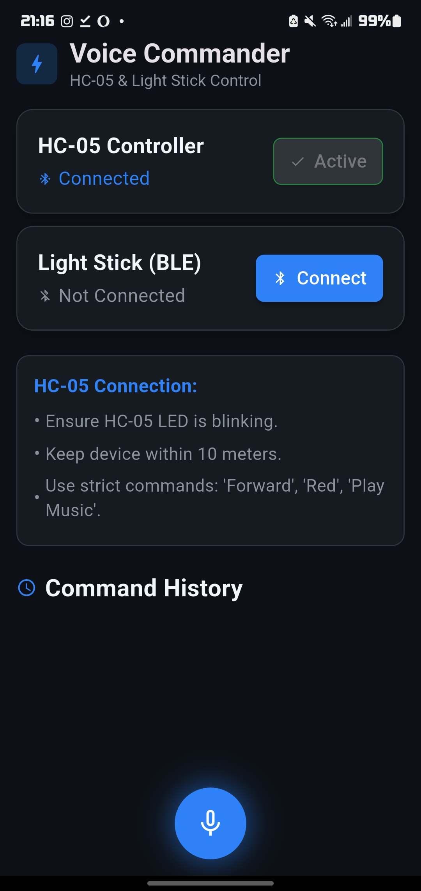

# Welcome-on-board

We are implementing an autonomous smart car system using the **PIC XC8** compiler.

The system is integrated with an **HC-05 Bluetooth module**, serving as a bi-directional bridge between our custom Android application and the target **PIC18F4520** microcontroller (via UART).

### Project Inspiration: _My Neighbor Totoro_

> _My Neighbor Totoro_ is a beloved Japanese animation deeply rooted in our hearts.
>
> Inspired by Totoro's warm-hearted nature, we designed this system to bring joy to its interactions. When passengers tap their card on the **RFID sensor**, the car plays the "On-Board Dance" theme song while the integrated light stick glows in synchronization. This feature aims to create a shared moment of cheer, reflecting our belief that technology should positively impact human connection and foster a brighter future.

## Automated Car Components

We utilize the following hardware components to ensure precise control and interactivity.

### Microcontroller & Processing

1. **MCU:** Microchip PIC18F4520
2. **Programmer:** MPLAB PICkit 4
3. **Audio:** DFPlayer Mini (MP3 Player Module)

### Sensors

### Sensors & Input

1. **Identification:** RFID Sensor Module (RC522)
2. **Environment:** Ambient Light Sensor (ALS) Module
3. **Navigation:** Ultrasonic

### Displays

1. 7-segment Display
2. OLED Display

### Actuators & Power

1. **Drive:** L298N Motor Driver
2. **Motors:** DC Motors
3. **Power:** 6x AA Batteries

## Mobile App Workflow

1. **Voice Activation** - Tapping the mic button initializes the device's native speech recognition engine.
2. **Real-Time Transcription** - The app captures audio input and converts speech to text instantaneously.
3. **Intent Resolution** - The transcribed text is processed to identify the user's intent.
4. **LLM Parsing** - The text is sent to gemini-2.0-flash to convert natural language (e.g., "Please turn left now") into a standardized protocol command (e.g., `TURN_LEFT`).
5. **Bluetooth Transmission** - The resolved command is transmitted via Bluetooth to the HC-05/ESP32 receiver.

## Voice Commands

Once your phone is paired with the HC-05 module via the [Voice Command Hub App](https://github.com/Seanachan/Voice-Command-Hub.git), you can control the vehicle using natural speech. Below is the mapping of supported commands:

**Movement:**

- "Go forward" → `FORWARD`
- "Back Up" → `REVERSE`
- "Parking" → `PARK`

**Steering:**

- "Turn left" → `TURN_LEFT`
- "Turn right" → `TURN_RIGHT`
- "Go straight" → `STRAIGHT`

**Gears:**

- "High Speed" → `HIGH_SPEED`
- "Low Speed" → `LOW_SPEED`

**Lights:**

- "Light stick turns Red" → `RED`
- "Light stick turns Blue" → `BLUE`
- "Light stick turns Green" → `GREEN`

**Music:**

- "Play Music" → `PLAY_MUSIC`
- "Stop Music" → `STOP_MUSIC`
- "Volume Up" → `VOL_UP`
- "Volume Down" → `VOL_DOWN`

**Other:**

- "Honk" → `HONK`

## IU-IKE Light Stick Integration

> We have integrated the official **IU-IKE Light Stick** to enhance the visual experience.
> By reverse-engineering the official Bluetooth protocol, we successfully identified the data structures required to control the device's functions, including color selection, blinking frequency, and breathing speed.

## App Interface

